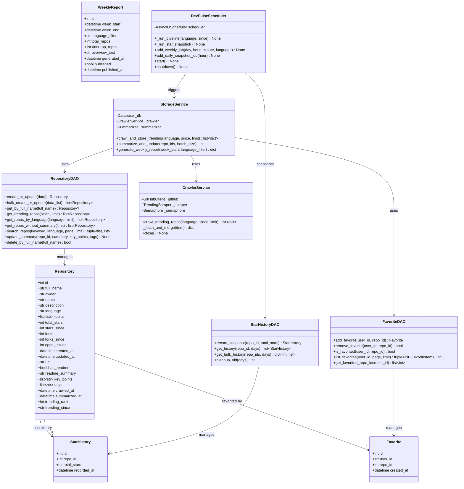
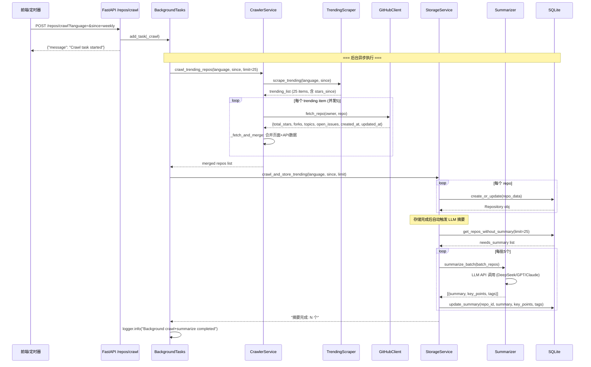
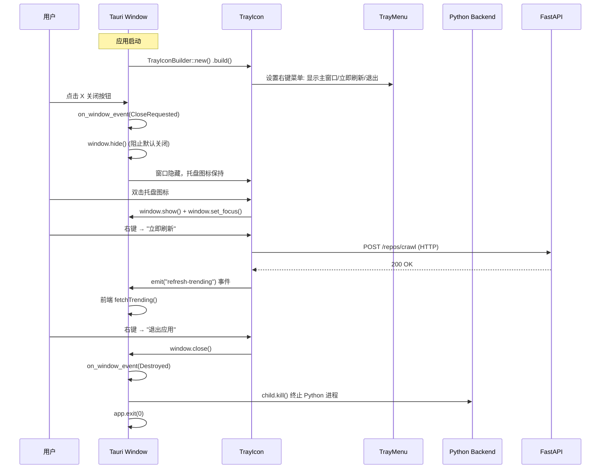
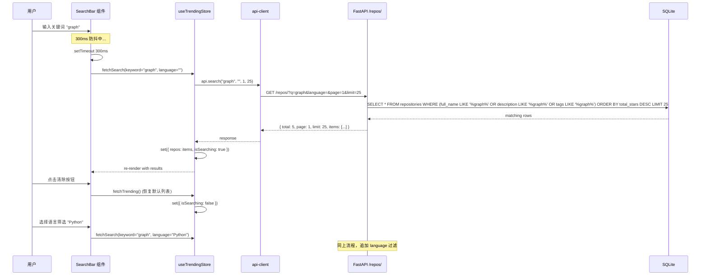
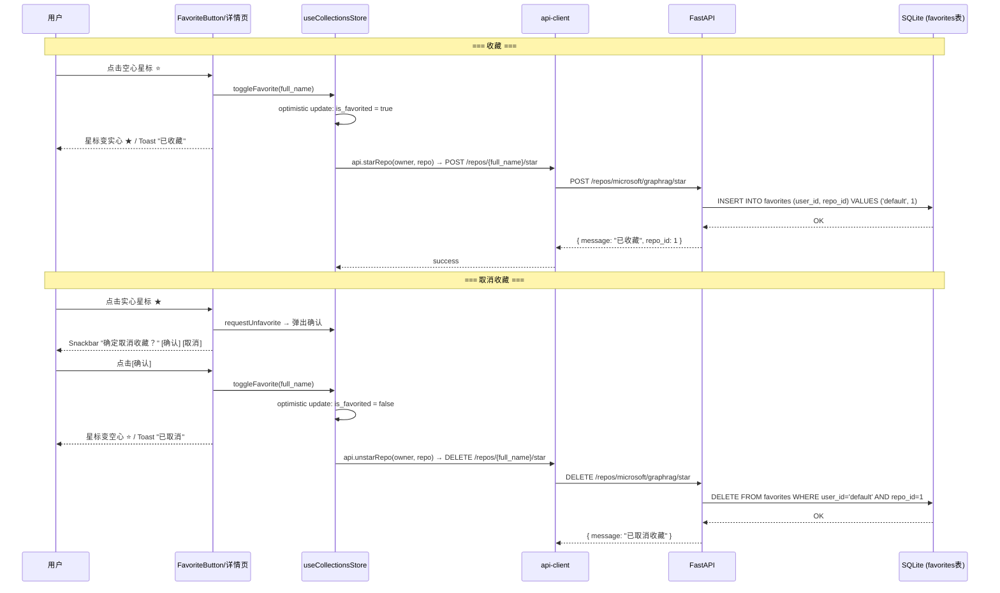
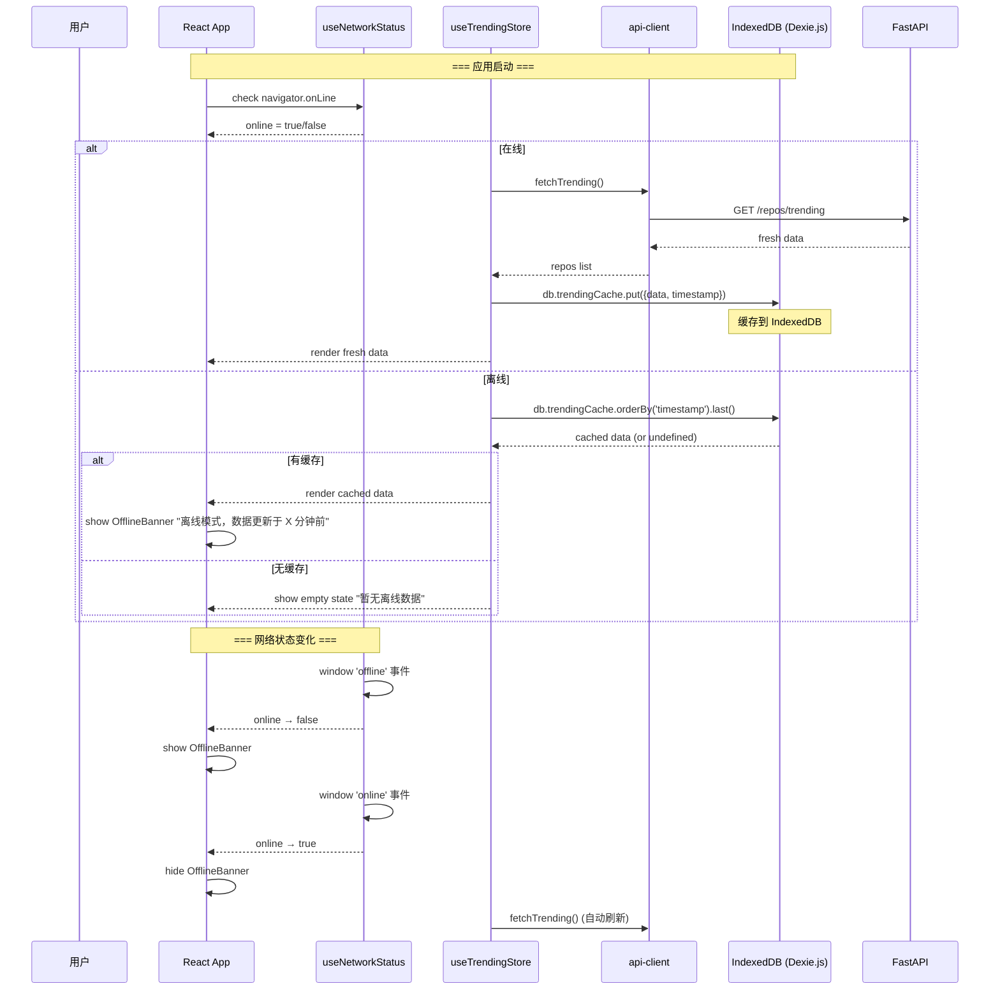
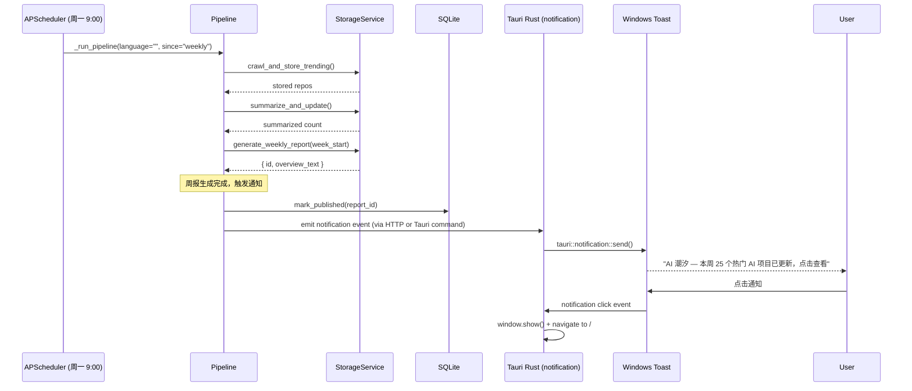
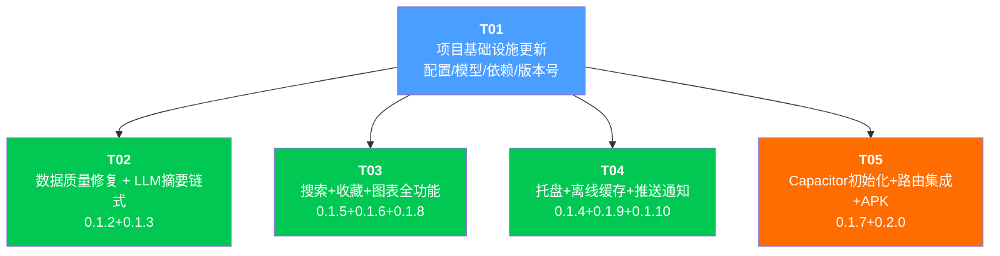

# DevPulse 0.1.2→0.2.0 系统架构设计

> **文档版本**: 1.0  
> **设计者**: 高见远 (Bob, Architect)  
> **基线代码**: 0.1.0（Tauri 桌面 MVP 可用）  
> **目标版本**: 0.2.0（Android APK 发布）  
> **日期**: 2026-05-28

---

## Part A: 系统设计

### A1. 实现方案与框架选型

#### A1.1 核心技术挑战

| # | 挑战 | 影响范围 | 解决策略 |
|---|------|---------|---------|
| 1 | `total_stars` 全为 0：爬虫仅从 Trending 页面抓取 `stars_since`，未调 GitHub API 获取真实 Star 总数 | 0.1.2 | Trending 页面已有 stargazers 链接含 `aria-label`，但部分项目缺失；补全 GitHubClient API 调用 + fallback 页面解析 |
| 2 | LLM 摘要管线未激活：`summarize_and_update()` 已实现但 `/repos/crawl` 爬虫完成后未链式调用 | 0.1.3 | 在 `crawl_trending` 后台任务中追加摘要调用；仅对摘要为 null 的项目生成 |
| 3 | 离线缓存策略：Tauri 环境下前端运行在 WebView，不能直接访问 Rust SQLite；桌面场景无 Service Worker | 0.1.9 | 前端使用 Dexie.js（IndexedDB 封装）做浏览器端缓存，不依赖 Tauri Rust 侧 |
| 4 | 系统托盘：Tauri 2.x 的 tray 插件 API 在不同版本间变化较大 | 0.1.4 | 使用 `tauri::tray::TrayIconBuilder`（Tauri 2.0+ 稳定 API），关闭窗口事件拦截 |
| 5 | Star 趋势无历史数据：GitHub API 只返回当前 total_stars | 0.1.8 | 新建 `star_history` 表，APScheduler 每日快照；图表初期显示现有趋势数据 + 占位未来趋势 |
| 6 | Android 构建链：Capacitor 8.x + Tauri 共存于同一 `desktop/` 目录，需隔离 mobile 配置 | 0.1.7/0.2.0 | 在项目根目录新建 `mobile/` 子目录，独立 `package.json` 和 `capacitor.config.ts`，符号链接共享 `src/` |

#### A1.2 框架与库选型

| 用途 | 选型 | 版本 | 理由 |
|------|------|------|------|
| 离线缓存 | **Dexie.js** | ^4.0 | IndexedDB 最成熟封装，Promise API，支持索引查询，体积小(~20KB) |
| 系统托盘 | **tauri::tray::TrayIconBuilder** | Tauri 2.x 内置 | Tauri 2.x 官方稳定 API，无需额外插件 |
| 推送通知 | **tauri-plugin-notification** | ^2.0 | Tauri 官方通知插件，支持 Windows Toast |
| 趋势图表 | **Recharts** | 已安装 2.x | 已在 `package.json` 中声明，零额外依赖 |
| Capacitor 移动端 | **@capacitor/core + @capacitor/android** | 已安装 8.x | 已在 `package.json` 中声明，仅需初始化 |
| Star 历史采集 | **APScheduler** | 已安装 | 已有 CronTrigger 机制，新增每日快照任务 |
| 收藏存储 | **SQLAlchemy ORM** | 已安装 | 新增 `favorites` 表即可，无需额外依赖 |
| API 环境变量 | **Vite env variables** | Vite 6.x 内置 | `VITE_API_BASE_URL` 编译时注入 |

#### A1.3 架构决策记录 (ADR)

| ADR# | 决策 | 理由 | 备选方案 |
|------|------|------|---------|
| ADR-01 | 收藏使用独立 `favorites` 表而非 JSON 字段 | 便于未来多用户扩展、索引查询、取消收藏操作 | `repositories.is_favorited` 布尔字段（简单但无扩展性） |
| ADR-02 | 离线缓存使用前端 IndexedDB（Dexie.js）而非 Tauri Rust SQLite | 代码跨平台可复用（Web/Android 均可使用 IndexedDB）；不增加 Rust 侧复杂度；数据量小（25条×3字段） | Tauri Rust SQLite（仅桌面可用，Android 不可用） |
| ADR-03 | Star 趋势使用每日 APScheduler 快照 + `star_history` 表 | 初期数据稀疏（≤30天数据），但可持续积累；无需第三方 API | 第三方 Star History API（有配额限制且不稳定） |
| ADR-04 | Android 构建在独立 `mobile/` 目录，不污染 `desktop/` | `desktop/` 同时有 Vite + Tauri 配置，混入 Capacitor 配置会冲突 | 在 `desktop/` 中直接初始化 Capacitor（配置冲突风险高） |
| ADR-05 | 搜索使用 SQLite LIKE + 索引，不引入 FTS5 | 数据量小（<10000条），LIKE 在索引列上足够快；FTS5 增加维护复杂度 | SQLite FTS5（全文搜索更强但需维护触发器同步） |
| ADR-06 | LLM 摘要仅在爬虫后台任务中自动触发，手动爬虫也触发 | 保证数据新鲜度；PRD 建议"仅对新项目生成摘要"控制成本 | 仅在定时任务触发（手动爬虫后无摘要） |

---

### A2. 完整文件列表

> 标注: **[NEW]** = 新建文件, **[MODIFY]** = 修改已有文件, **[NO CHANGE]** = 参考文件无需修改

#### A2.1 后端 (Python FastAPI)

```
backend/devpulse/
├── api/endpoints/
│   ├── repos.py              [MODIFY] 新增搜索/收藏/趋势端点
│   └── collections.py        [NEW]    收藏列表端点 GET /collections
├── core/
│   ├── models.py             [MODIFY] 新增 Favorite、StarHistory 模型
│   ├── database.py           [NO CHANGE] 已有 create_tables 自动建表
│   └── repository.py         [MODIFY] 新增 FavoriteDAO、StarHistoryDAO、搜索方法
├── services/
│   ├── storage.py            [MODIFY] crawl_and_store_trending 追加 LLM 摘要链式调用
│   ├── scheduler.py          [MODIFY] 新增 star_history 每日快照任务；周报完成后推送通知
│   ├── crawler.py            [MODIFY] 确保 total_stars 优先从 API 获取
│   ├── trending_scraper.py   [MODIFY] 修复 total_stars 页面抓取（stargazers aria-label）
│   ├── github_client.py      [MODIFY] 新增 fetch_repo 补充字段（stars/forks/issues/created_at）
│   └── summarizer.py         [NO CHANGE] 摘要逻辑已就绪
├── config.py                 [MODIFY] 新增 CORS origins (capacitor://localhost)；通知配置
└── main.py                   [MODIFY] 新增 collections_router 挂载
```

#### A2.2 前端 (React TypeScript)

```
desktop/src/
├── components/
│   ├── Layout.tsx                    [MODIFY] Header 新增 SearchBar；导航新增 Collections/Settings
│   ├── RepoTrendingCard.tsx          [MODIFY] 三指标行(Stars Since/Total Stars/Forks)；收藏星标；Tags行
│   ├── TrendingList.tsx              [NO CHANGE] 已支持三态（loading/error/empty）
│   ├── SkeletonCard.tsx              [NO CHANGE] 骨架屏已就绪
│   ├── SearchBar.tsx                 [NEW]    搜索框组件（防抖300ms + 清除按钮 + 语言筛选）
│   ├── OfflineBanner.tsx             [NEW]    离线模式顶部 Banner 组件
│   ├── StarChart.tsx                 [NEW]    30天 Star 增长折线图（Recharts LineChart）
│   ├── LanguagePieChart.tsx          [NEW]    语言分布饼图（Recharts PieChart）
│   └── FavoriteButton.tsx            [NEW]    收藏按钮组件（实心/空心星标切换）
├── pages/
│   ├── TrendingPage.tsx              [MODIFY] 集成 SearchBar + LanguagePieChart
│   ├── RepoDetailPage.tsx            [MODIFY] 三指标统计 + Tags行 + AI摘要区 + StarChart + FavoriteButton
│   ├── CollectionsPage.tsx           [NEW]    收藏列表页（空状态 + 收藏卡片列表）
│   └── SettingsPage.tsx              [NEW]    设置页（通知开关 Toggle）
├── stores/
│   ├── useTrendingStore.ts           [MODIFY] 集成搜索参数 + 离线缓存逻辑
│   ├── useRepoDetailStore.ts         [MODIFY] 新增仓库详情字段映射
│   ├── useCollectionsStore.ts        [NEW]    收藏状态管理
│   ├── useSettingsStore.ts           [NEW]    设置状态管理（通知开关持久化 localStorage）
│   └── useNetworkStatus.ts           [NEW]    网络状态检测 Hook
├── utils/
│   ├── api-client.ts                 [MODIFY] 新增 search/collections/trends API 方法
│   ├── db.ts                         [NEW]    Dexie.js IndexedDB 缓存层
│   └── formatters.ts                 [NEW]    数字/日期格式化工具函数
├── types/
│   └── index.ts                      [MODIFY] 新增 FavoriteItem、TrendPoint、LanguageStat 类型
├── App.tsx                           [MODIFY] 新增路由 /collections, /settings
└── main.tsx                          [NO CHANGE]
```

#### A2.3 Tauri 桌面 (Rust)

```
desktop/src-tauri/
├── src/
│   └── lib.rs                    [MODIFY] 新增托盘图标、关闭到托盘、右键菜单逻辑
├── tauri.conf.json               [MODIFY] 版本号→0.2.0；新增 notification 插件权限
├── Cargo.toml                    [MODIFY] 新增 tauri-plugin-notification 依赖
├── capabilities/
│   └── default.json              [MODIFY] 新增 notification:default 权限
└── icons/
    └── tray-icon.ico             [NEW]    16×16 + 32×32 托盘图标
```

#### A2.4 Capacitor 移动端

```
mobile/
├── package.json                  [NEW]    mobile 独立包配置
├── capacitor.config.ts           [NEW]    Capacitor 配置（server.url 指向后端）
├── tsconfig.json                 [NEW]    TypeScript 配置
├── vite.config.ts                [NEW]    Vite 构建配置（复用 desktop/src）
├── index.html                    [NEW]    移动端入口 HTML
├── android/                      [NEW]    npx cap add android 生成
└── src/                          [NEW]    符号链接 → ../desktop/src（共享代码）
```

---

### A3. 数据结构设计

#### A3.1 新增数据库模型 (SQLAlchemy ORM)

```python
# backend/devpulse/core/models.py 新增

class Favorite(Base):
    """用户收藏关联表.
    
    独立表设计，支持未来多用户扩展（当前 user_id 固定为 'default'）。
    """
    __tablename__ = "favorites"

    id: int = Column(Integer, primary_key=True, autoincrement=True)
    user_id: str = Column(String(100), nullable=False, default="default", index=True)
    repo_id: int = Column(Integer, nullable=False, index=True)
    created_at: datetime = Column(DateTime, default=datetime.utcnow)

    __table_args__ = (
        Index("idx_fav_user_repo", "user_id", "repo_id", unique=True),
    )


class StarHistory(Base):
    """Star 历史快照表.
    
    每日定时采集所有 Trending 仓库的 total_stars，用于趋势图表。
    """
    __tablename__ = "star_history"

    id: int = Column(Integer, primary_key=True, autoincrement=True)
    repo_id: int = Column(Integer, nullable=False, index=True)
    total_stars: int = Column(Integer, nullable=False)
    recorded_at: datetime = Column(DateTime, nullable=False, index=True)

    __table_args__ = (
        Index("idx_sh_repo_date", "repo_id", "recorded_at"),
    )
```

#### A3.2 新增 TypeScript 类型

```typescript
// desktop/src/types/index.ts 新增

/** 收藏项目 */
export interface FavoriteItem {
  id: number;
  repo_id: number;
  full_name: string;
  owner: string;
  name: string;
  description: string;
  language: string;
  total_stars: number;
  stars_since: number;
  tags: string[];
  created_at: string;   // 收藏时间 ISO 8601
}

/** Star 趋势数据点 */
export interface TrendPoint {
  date: string;          // "2026-05-01"
  stars: number;
}

/** 编程语言分布统计 */
export interface LanguageStat {
  language: string;
  count: number;
  percentage: number;
}

/** API 响应中的已追加剧透字段 */
export interface Repo {
  // ...existing fields...
  open_issues?: number;
  created_at?: string;
  updated_at?: string;
  is_favorited?: boolean;  // 当前用户是否已收藏
}
```

#### A3.3 新增 API 端点定义

| Method | Endpoint | Request | Response (data) | 归属版本 |
|--------|----------|---------|-----------------|---------|
| GET | `/repos/?q={keyword}&language={lang}&page=1&limit=25` | Query params | `{ total, page, limit, items: Repo[] }` | 0.1.5 |
| POST | `/repos/{full_name}/star` | — | `{ message: "已收藏", repo_id: N }` | 0.1.6 |
| DELETE | `/repos/{full_name}/star` | — | `{ message: "已取消收藏" }` | 0.1.6 |
| GET | `/collections` | — | `{ total, items: FavoriteItem[] }` | 0.1.6 |
| GET | `/repos/trends?period=30d` | Query params | `{ items: { full_name, history: TrendPoint[] }[] }` | 0.1.8 |
| GET | `/repos/stats/languages` | — | `{ items: LanguageStat[] }` | 0.1.8 |

#### A3.4 现有 API 响应增强

| Endpoint | 现有响应 | 新增字段 |
|----------|---------|---------|
| `GET /repos/` | `{ items: [...] }` | 每项新增 `is_favorited: boolean` |
| `GET /repos/{full_name}` | 已有完整字段 | 新增 `open_issues, created_at, updated_at, forks_since, is_favorited` |

#### A3.5 Mermaid 类图



---

### A4. 程序调用流程

#### A4.1 爬虫 + LLM 摘要链式调用（0.1.2+0.1.3）



#### A4.2 系统托盘与窗口管理（0.1.4）



#### A4.3 搜索交互流（0.1.5）



#### A4.4 收藏操作流（0.1.6）



#### A4.5 离线缓存决策流（0.1.9）



#### A4.6 推送通知触发流（0.1.10）



---

### A5. 待明确事项与架构建议

| # | PRD 问题 | 架构建议 | 理由 |
|---|---------|---------|------|
| Q1 | favorites 存储方案 | ✅ **采用独立 `favorites` 表** (`user_id + repo_id + created_at`)，当前 `user_id` 固定为 `"default"` | 便于未来多用户扩展；单字段 `is_favorited` 无法记录收藏时间、不支持多用户 |
| Q2 | Star 历史数据来源 | ✅ **采用方案 A：每日 APScheduler 快照** + 新建 `star_history` 表 | 0.1.8 开始时可能历史数据较少（≤7天），但可持续积累；Star History API 有配额不稳定 |
| Q3 | Capacitor 本期范围 | ✅ **仅初始化项目结构 + `npx cap sync android` 成功**，不要求独立构建 | 降低 0.1.7 门槛；0.2.0 再做 Gradle 构建 |
| Q4 | 离线缓存存储选型 | ✅ **采用前端 IndexedDB (Dexie.js)**，不依赖 Tauri Rust SQLite | 跨平台复用（Web/Android 均可）；Tauri Rust SQLite 仅桌面可用且需 IPC 通信 |
| Q5 | LLM 摘要成本控制 | ✅ **仅对新项目生成摘要**（`summarized_at IS NULL`）+ 支持配置最大摘要数（默认25） | 避免重复生成浪费 token；已有仓库跳过 |
| Q6 | 推送通知触发时机 | ✅ **仅在定时任务（每周一 9:00）触发通知**，手动爬虫不推送 | 避免频繁打扰用户；手动爬虫是开发者行为 |
| Q7 | Android keystore 管理 | ✅ **自动生成 debug.keystore** 用于 debug APK；release 签名由项目 Owner 后续提供 | debug 阶段无需正式签名；release keystore 不入 Git |

---

## Part B: 任务分解

### B1. 新增依赖包清单

#### Python (requirements.txt 追加)

```
# 无新增 Python 依赖 — 所有功能基于已有依赖实现
# 已有: fastapi, sqlalchemy, aiosqlite, playwright, httpx, apscheduler, pydantic-settings
```

#### npm (desktop/package.json 追加)

```
dexie@^4.0.1          # IndexedDB 封装，离线缓存
recharts@^2.15.0       # 已安装，趋势图表（确认可用）
```

#### Cargo (Cargo.toml 追加)

```toml
tauri-plugin-notification = "2"    # Windows Toast 推送通知
```

#### Capacitor (mobile/package.json)

```
@capacitor/core@^8.3.4      # 已安装在 desktop/，mobile/ 重新声明
@capacitor/android@^8.3.4   # Android 平台支持
@capacitor/cli@^8.3.4       # CLI 工具
```

---

### B2. 任务列表 (按实现顺序)

| Task ID | 任务名称 | 归属版本 | 描述 | 依赖 | 优先级 | 涉及文件 |
|---------|---------|---------|------|------|:------:|---------|
| **T01** | 项目基础设施更新 | 0.1.2→0.2.0 | 更新版本号、Cargo 依赖、npm 依赖、CORS 配置、新增数据库模型（Favorite + StarHistory）、配置文件更新 | — | P0 | `backend/devpulse/config.py` [MODIFY], `backend/devpulse/core/models.py` [MODIFY], `backend/devpulse/main.py` [MODIFY], `desktop/src-tauri/tauri.conf.json` [MODIFY], `desktop/src-tauri/Cargo.toml` [MODIFY], `desktop/src-tauri/capabilities/default.json` [MODIFY], `desktop/package.json` [MODIFY], `desktop/src/types/index.ts` [MODIFY] |
| **T02** | 数据质量修复 + LLM 摘要链式触发 | 0.1.2+0.1.3 | GitHub API 详情补全（total_stars/forks/open_issues/created_at）；爬虫完成后自动触发 LLM 摘要管线；前端卡片三指标改造 + 摘要区渲染 | T01 | P0 | `backend/devpulse/services/github_client.py` [MODIFY], `backend/devpulse/services/trending_scraper.py` [MODIFY], `backend/devpulse/services/crawler.py` [MODIFY], `backend/devpulse/services/storage.py` [MODIFY], `backend/devpulse/api/endpoints/repos.py` [MODIFY], `desktop/src/components/RepoTrendingCard.tsx` [MODIFY], `desktop/src/pages/RepoDetailPage.tsx` [MODIFY], `desktop/src/stores/useRepoDetailStore.ts` [MODIFY] |
| **T03** | 搜索 + 收藏 + 图表 全功能模块 | 0.1.5+0.1.6+0.1.8 | 后端：搜索端点(全文LIKE)、收藏CRUD端点、趋势数据端点、语言统计端点。前端：SearchBar组件、FavoriteButton组件、CollectionsPage、StarChart、LanguagePieChart、对应Store | T01 | P0 | `backend/devpulse/api/endpoints/repos.py` [MODIFY], `backend/devpulse/api/endpoints/collections.py` [NEW], `backend/devpulse/core/repository.py` [MODIFY], `desktop/src/components/SearchBar.tsx` [NEW], `desktop/src/components/FavoriteButton.tsx` [NEW], `desktop/src/components/StarChart.tsx` [NEW], `desktop/src/components/LanguagePieChart.tsx` [NEW], `desktop/src/pages/CollectionsPage.tsx` [NEW], `desktop/src/pages/TrendingPage.tsx` [MODIFY], `desktop/src/stores/useCollectionsStore.ts` [NEW], `desktop/src/stores/useTrendingStore.ts` [MODIFY], `desktop/src/utils/api-client.ts` [MODIFY], `desktop/src/utils/formatters.ts` [NEW], `desktop/src/types/index.ts` [MODIFY] |
| **T04** | 系统托盘 + 离线缓存 + 推送通知 | 0.1.4+0.1.9+0.1.10 | Tauri 托盘(CloseRequested→hide+右键菜单)；Dexie.js IndexedDB缓存层+OfflineBanner+useNetworkStatus；Tauri notification插件+周报推送+SettingsPage；Star History快照任务 | T01 | P0 | `desktop/src-tauri/src/lib.rs` [MODIFY], `desktop/src-tauri/icons/tray-icon.ico` [NEW], `desktop/src/utils/db.ts` [NEW], `desktop/src/components/OfflineBanner.tsx` [NEW], `desktop/src/stores/useNetworkStatus.ts` [NEW], `desktop/src/stores/useSettingsStore.ts` [NEW], `desktop/src/pages/SettingsPage.tsx` [NEW], `desktop/src/components/Layout.tsx` [MODIFY], `backend/devpulse/services/scheduler.py` [MODIFY], `backend/devpulse/core/repository.py` [MODIFY], `desktop/src-tauri/tauri.conf.json` [MODIFY], `desktop/src-tauri/capabilities/default.json` [MODIFY] |
| **T05** | Capacitor 初始化 + 路由集成 + Android 发布 | 0.1.7+0.2.0 | mobile/目录初始化 + capacitor.config.ts + Android项目 + Vite构建配置；App.tsx路由集成(Collections+Settings)；移动端UI自适应；APK签名构建 | T01 | P0 | `mobile/package.json` [NEW], `mobile/capacitor.config.ts` [NEW], `mobile/vite.config.ts` [NEW], `mobile/tsconfig.json` [NEW], `mobile/index.html` [NEW], `desktop/src/App.tsx` [MODIFY], `desktop/src/components/Layout.tsx` [MODIFY], `backend/devpulse/config.py` [MODIFY] |

---

### B3. 共享知识（跨文件约定）

#### B3.1 API 响应格式

```
所有 API 响应使用扁平格式（与现有代码保持一致，不使用 {code, data, message} 封装）:
- 列表端点: { total, page?, limit?, items: [...] }
- 操作端点: { message: "xxx", repo_id?: N }
- 详情端点: 直接返回对象
```

#### B3.2 错误处理模式

```
前端:
- api-client.ts 已有 5 次重试机制（1s 间隔）
- Store 层 catch 后 set({ error: "用户可读的中文错误提示" })
- 组件层展示错误态（TrendingList 已实现三态切换）

后端:
- 使用 HTTPException 抛标准 HTTP 错误
- 后台任务异常通过 logger.exception 记录
- GitHub API 异常已有分类处理（GitHubClientError 体系）
```

#### B3.3 命名规范

```
Python:
- 文件名: snake_case
- 类名: PascalCase
- 函数/方法: snake_case
- 私有方法: _leading_underscore
- 类型标注: 全部函数签名均有类型标注

TypeScript/React:
- 文件名: PascalCase（组件）/ camelCase（工具/Hook/Store）
- 组件: function ComponentName() {} （函数组件 + Hooks）
- Hook: useXxx
- Store: useXxxStore
- API Client: api.xxxMethod()
```

#### B3.4 离线缓存数据结构 (Dexie.js)

```typescript
// IndexedDB 表结构 (desktop/src/utils/db.ts)
interface TrendingCache {
  id?: number;           // auto-increment
  timestamp: number;     // Date.now()
  since: string;         // "weekly" | "daily" | "monthly"
  language: string;      // "" = all
  data: Repo[];          // 完整 Repo 数组
}

// 缓存策略:
// - 每次成功 fetchTrending() 后写入
// - 读取时取最新一条 (orderBy('timestamp').last())
// - 7天前数据自动清理 (timestamp < Date.now() - 7*24*3600*1000)
```

#### B3.5 系统托盘图标规格

```
- 文件名: tray-icon.ico
- 尺寸: 16×16 + 32×32 (嵌入 .ico)
- 位置: desktop/src-tauri/icons/tray-icon.ico
- 来源: 复用现有 icon.ico 缩放（或设计专用版本）
```

#### B3.6 移动端环境变量

```bash
# mobile/.env (mobile 构建时使用)
VITE_API_BASE_URL=http://192.168.1.x:8000   # 开发时指向局域网后端
# 生产构建时替换为实际服务器地址
```

---

### B4. 任务依赖图



> **说明**: T02-T05 均仅依赖 T01（基础设施），相互之间可并行开发。T05 依赖 T01 的配置更新和类型定义，但不需要等待 T02-T04 完成。

---

### B5. 各任务验收标准

#### T01 验收标准

- [ ] `backend/devpulse/core/models.py` 新增 `Favorite` 和 `StarHistory` 两个 ORM 模型，`create_tables()` 自动建表成功
- [ ] `backend/devpulse/config.py` 新增 `capacitor://localhost` 到 CORS origins
- [ ] `desktop/src-tauri/Cargo.toml` 新增 `tauri-plugin-notification = "2"` 依赖，`cargo check` 通过
- [ ] `desktop/package.json` 新增 `dexie@^4.0.1` 依赖，`pnpm install` 成功
- [ ] `desktop/src-tauri/tauri.conf.json` 版本号更新为 `0.2.0`
- [ ] `desktop/src/types/index.ts` 新增 `FavoriteItem`, `TrendPoint`, `LanguageStat` 类型定义
- [ ] `desktop/src-tauri/capabilities/default.json` 新增 `"notification:default"` 权限

#### T02 验收标准

- [ ] 爬虫执行后 `total_stars` ≥ 0（不再全为 0），`forks` ≥ 0，`open_issues` ≥ 0
- [ ] `POST /repos/crawl` 后台任务完成后，新增仓库的 `summarized_at` 不为 null
- [ ] `RepoTrendingCard` 显示三列指标：Stars Since / Total Stars / Forks
- [ ] `RepoDetailPage` 详情页展示 Forks / Open Issues / Created At 完整元数据
- [ ] `RepoDetailPage` 展示 AI 摘要区域（summary + key_points + tags），null 时不崩溃
- [ ] 已生成摘要的仓库不会重复调用 LLM（`summarized_at IS NULL` 过滤）

#### T03 验收标准

- [ ] `GET /repos/?q=xxx&language=xxx` 返回匹配结果，空搜索返回全部
- [ ] `POST /repos/{full_name}/star` 收藏成功返回 `{ message: "已收藏" }`
- [ ] `DELETE /repos/{full_name}/star` 取消收藏成功
- [ ] `GET /collections` 返回已收藏项目列表，空列表时不报错
- [ ] `GET /repos/trends?period=30d` 返回 Star 历史数据数组
- [ ] `GET /repos/stats/languages` 返回语言分布统计数据
- [ ] `SearchBar` 组件：输入关键词 → 300ms 防抖 → 列表过滤；清除按钮恢复默认
- [ ] `FavoriteButton`：点击切换星标状态，取消时弹出确认提示
- [ ] `CollectionsPage`：展示收藏列表；空状态友好提示
- [ ] `StarChart`：Recharts LineChart 渲染 Star 增长曲线；空数据时显示"暂无趋势数据"
- [ ] `LanguagePieChart`：Recharts PieChart 渲染语言分布；支持加载态和空态
- [ ] 列表卡片显示收藏状态（实心/空心星标）

#### T04 验收标准

- [ ] 点击窗口 X → 窗口隐藏到托盘，不退出应用
- [ ] 托盘图标显示在系统托盘区
- [ ] 右键托盘图标 → 显示主窗口/立即刷新/退出 三个菜单项
- [ ] 双击托盘图标恢复主窗口
- [ ] 断网后打开 App → 展示上次缓存的 Trending 数据
- [ ] 离线时页面顶部显示黄色 Banner "当前为离线模式，数据更新于 X 分钟前"
- [ ] 恢复网络后自动刷新数据 + 移除离线 Banner
- [ ] 每周一 9:00 定时任务生成周报后弹出 Windows Toast 通知
- [ ] 通知内容包含"AI 潮汐 — 本周 X 个热门 AI 项目已更新"
- [ ] 点击通知跳转到 TrendingPage
- [ ] `SettingsPage` 提供通知开关 Toggle，状态持久化到 localStorage
- [ ] APScheduler 每日快照 `star_history` 表正常工作

#### T05 验收标准

- [ ] `mobile/` 目录结构完整：`package.json` + `capacitor.config.ts` + `vite.config.ts` + `tsconfig.json` + `index.html`
- [ ] `mobile/capacitor.config.ts` 中 `server.url` 支持环境变量注入
- [ ] `npx cap sync android` 执行成功，`mobile/android/` 项目结构完整
- [ ] `App.tsx` 新增 `/collections` 和 `/settings` 路由
- [ ] `Layout.tsx` 底部导航新增 Collections 和 Settings Tab
- [ ] 移动端 UI 字体/间距/触控区域自适应（Tailwind responsive 断点）
- [ ] `npx cap build android` 产出 debug APK
- [ ] APK 在至少一台真机上安装并启动成功
- [ ] 首页列表渲染正常，详情页跳转正常
